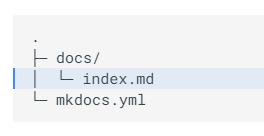
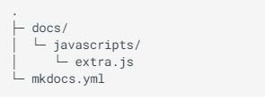

# 开始

Material for MkDocs 项目地址

* [github地址](https://github.com/squidfunk/mkdocs-material)
* [官方文档地址](https://squidfunk.github.io/mkdocs-material/)

## 入门

Material for MkDocs是MkDocs之上的一个强大的文档框架，MkDocs是一个用于项目文档的静态站点生成器。 [1](https://squidfunk.github.io/mkdocs-material/getting-started/#fn:1) 如果你熟悉 Python，你可以使用 Python 包管理器 `pip` 安装 Material for MkDocs。如果没有，我们建议使用 `docker` 。
## pip 安装 

Material for MkDocs作为Python软件包发布，可以与 `pip` 一起安装，理想情况下是使用虚拟环境。打开一个终端并安装MkDocs的材料：

```sh
pip install mkdocs-material
```

这将自动安装所有依赖项的兼容版本：MkDocs，Markdown，Pygments和Python Markdown Extensions。Material for MkDocs 始终努力支持最新版本，因此无需单独安装这些软件包。

如何通过 [@james-willett](https://github.com/james-willett "GitHub User: james-willett") –  15m – 了解如何在分步指南中使用 GitHub 页面上的 MkDocs 材料创建和托管文档站点。

提示：如果您之前没有使用Python的经验，我们建议您阅读使用Python的pip来管理项目的依赖项，这是对Python包管理机制的非常好的介绍，可以帮助您在遇到错误时进行故障排除。

## 使用 docker 启动 Material for MkDocs

官方 Docker 映像是在几分钟内启动并运行的好方法，因为它预装了所有依赖项。打开终端并拉取图像：

```sh
docker pull squidfunk/mkdocs-material
```
可以用docker拉取镜像并启动

`mkdocs` 可执行文件作为入口点提供， `serve` 是默认命令。如果您不熟悉 Docker，请不要担心，我们将在以下部分中介绍您。

以下插件与 Docker 镜像捆绑在一起：

- [mkdocs-minify-plugin mkdocs-minify-plugin](https://github.com/byrnereese/mkdocs-minify-plugin)
- [mkdocs-redirects](https://github.com/datarobot/mkdocs-redirects)


如何将插件添加到 Docker 镜像中？

为了保持官方图片的小尺寸，MkDocs的材料只捆绑了选定的插件。如果你想使用的插件不包括在内，你可以很容易地添加它们:

创建一个' Dockerfile '并扩展官方图像:

Dockerfile
```
FROM squidfunk/mkdocs-material
RUN pip install mkdocs-macros-plugin
RUN pip install mkdocs-glightbox

```

接下来，使用以下命令构建映像:
```
docker build -t squidfunk/mkdocs-material .
```

新映像将安装额外的软件包，并且可以完全像官方映像一样使用。

## 使用 git 

Material for MkDocs可以直接从 GitHub 使用，方法是将存储库克隆到项目根目录的子文件夹中，如果您想使用最新版本，这可能会很有用：
```
git clone https://github.com/squidfunk/mkdocs-material.git
```


接下来，使用以下命令安装主题及其依赖项：
```
pip install -e mkdocs-material

```


---


1. 在 2016 年，Material for MkDocs最初是 MkDocs 的一个简单的主题，但经过几年的发展，它现在远不止于此——凭借许多内置插件、设置和无数的自定义功能，Material for MkDocs现在是为您的项目创建文档的最简单、最强大的框架之一。 

3. 请注意，现有功能的改进有时会作为补丁版本发布，例如改进的内容选项卡呈现，因为它们不被视为新功能。 
    
## 创建网站


安装 MkDocs 框架后，您可以使用 `mkdocs` 可执行文件引导项目文档。转到您希望项目所在的目录，然后输入：

```sh
mkdocs new  my-poject
```

或者，如果您从linux环境中 Docker 中运行 MkDocs 框架，请使用：

```sh
docker run --rm -it -v ${PWD}:/docs squidfunk/mkdocs-material new .

```

mkdocs新建项目结构：
![[Pasted image 20230924193339.png]]

## 配置

####  最小配置

只需将以下行添加到 `mkdocs.yml` 即可启用主题：

```
theme: 
	name: material
```

Recommended: [configuration validation and auto-complete](https://twitter.com/squidfunk/status/1487746003692400642)  

建议：配置验证和自动完成


为了尽量减少摩擦并最大限度地提高生产力，Material for MkDocs 为 `mkdocs.yml` 提供了自己的 schema.json [1](https://squidfunk.github.io/mkdocs-material/creating-your-site/#fn:1) 。如果您的编辑器支持 YAML 架构验证，则绝对建议对其进行设置：

[Visual Studio Code](https://squidfunk.github.io/mkdocs-material/creating-your-site/#minimal-configuration-visual-studio-code)[Other](https://squidfunk.github.io/mkdocs-material/creating-your-site/#minimal-configuration-other) 视觉工作室代码其他

1. Install [`vscode-yaml`](https://marketplace.visualstudio.com/items?itemName=redhat.vscode-yaml) for YAML language support.  
    安装 `vscode-yaml` 以获得 YAML 语言支持。
2. Add the schema under the `yaml.schemas` key in your user or workspace [`settings.json`](https://code.visualstudio.com/docs/getstarted/settings):  
    在用户或工作区 `settings.json` 中的 `yaml.schemas` 键下添加架构：
```
{
  "yaml.schemas": {
    "https://squidfunk.github.io/mkdocs-material/schema.json": "mkdocs.yml"
  },
  "yaml.customTags": [ 
    "!ENV scalar",
    "!ENV sequence",
    "tag:yaml.org,2002:python/name:material.extensions.emoji.to_svg",
    "tag:yaml.org,2002:python/name:material.extensions.emoji.twemoji",
    "tag:yaml.org,2002:python/name:pymdownx.superfences.fence_code_format"
  ]
}

```
## 高级配置

Material for MkDocs带有许多配置选项。设置部分详细介绍了如何配置和自定义颜色、字体、图标等：

- [Changing the colors 更改颜色](https://squidfunk.github.io/mkdocs-material/setup/changing-the-colors/)
- [Changing the fonts 更改字体](https://squidfunk.github.io/mkdocs-material/setup/changing-the-fonts/)
- [Changing the language 更改语言](https://squidfunk.github.io/mkdocs-material/setup/changing-the-language/)
- [Changing the logo and icons  
    更改徽标和图标](https://squidfunk.github.io/mkdocs-material/setup/changing-the-logo-and-icons/)
- [Ensuring data privacy 确保数据隐私](https://squidfunk.github.io/mkdocs-material/setup/ensuring-data-privacy/)
- [Setting up navigation 设置导航](https://squidfunk.github.io/mkdocs-material/setup/setting-up-navigation/)
- [Setting up site search  
    设置网站搜索](https://squidfunk.github.io/mkdocs-material/setup/setting-up-site-search/)
- [Setting up site analytics  
    设置站点分析](https://squidfunk.github.io/mkdocs-material/setup/setting-up-site-analytics/)
- [Setting up social cards  
    设置社交卡](https://squidfunk.github.io/mkdocs-material/setup/setting-up-social-cards/)
- [Setting up a blog  
    设置博客](https://squidfunk.github.io/mkdocs-material/setup/setting-up-a-blog/)

- [Setting up tags 设置标签](https://squidfunk.github.io/mkdocs-material/setup/setting-up-tags/)
- [Setting up versioning 设置版本控制](https://squidfunk.github.io/mkdocs-material/setup/setting-up-versioning/)
- [Setting up the header  
    设置标头](https://squidfunk.github.io/mkdocs-material/setup/setting-up-the-header/)
- [Setting up the footer  
    设置页脚](https://squidfunk.github.io/mkdocs-material/setup/setting-up-the-footer/)
- [Adding a git repository  
    添加 git 存储库](https://squidfunk.github.io/mkdocs-material/setup/adding-a-git-repository/)
- [Adding a comment system  
    添加注释系统](https://squidfunk.github.io/mkdocs-material/setup/adding-a-comment-system/)
- [Building an optimized site  
    构建优化的网站](https://squidfunk.github.io/mkdocs-material/setup/building-an-optimized-site/)
- [Building for offline usage  
    为离线使用而构建](https://squidfunk.github.io/mkdocs-material/setup/building-for-offline-usage/)

此外，请参阅支持的 Markdown 扩展列表，这些扩展与 MkDocs 材料原生集成，提供前所未有的低工作量技术写作体验。

## 编写时预览

MkDocs 包含一个实时预览服务器，因此您可以在编写文档时预览更改。服务器将在保存后自动重建站点。从以下方面开始：
```sh
mkdocs serve
```
如果您在linux环境中 Docker 中运行 MkDocs 材质，请使用：

```sh
docker run --rm -it -p 8000:8000 -v ${PWD}:/docs squidfunk/mkdocs-material
```
将浏览器指向 localhost：8000，您应该看到：


## 构建网站

完成编辑后，您可以使用以下命令从 Markdown 文件构建静态站点：
```
mkdocs build
```

如果您在 Docker 中运行 MkDocs 材质，请使用：
```
docker run --rm -it -v ${PWD}:/docs squidfunk/mkdocs-material build

```
此目录的内容构成您的项目文档。无需操作数据库或服务器，因为它是完全独立的。该网站可以托管在 GitHub 页面 ， GitLab 页面 ，您选择的 CDN 或您的私人网络空间。

## 发布网站


在 `git` 存储库中托管项目文档的好处是能够在推送新更改时自动部署它。MkDocs使这变得非常简单。

## GitHub 页面

If you're already hosting your code on GitHub, [GitHub Pages](https://pages.github.com/) is certainly the most convenient way to publish your project documentation. It's free of charge and pretty easy to set up.  
如果您已经在 GitHub 上托管代码，GitHub Pages 无疑是发布项目文档的最便捷方式。它是免费的，并且很容易设置。

## 与 GitHub 操作

Using [GitHub Actions](https://github.com/features/actions) you can automate the deployment of your project documentation. At the root of your repository, create a new GitHub Actions workflow, e.g. `.github/workflows/ci.yml`, and copy and paste the following contents:  
使用 GitHub 操作，您可以自动部署项目文档。在仓库的根目录中，创建一个新的 GitHub 操作工作流，例如 `.github/workflows/ci.yml` ，然后复制并粘贴以下内容：

```
name: ci 
on:
  push:
    branches:
      - master 
      - main
permissions:
  contents: write
jobs:
  deploy:
    runs-on: ubuntu-latest
    steps:
      - uses: actions/checkout@v4
      - uses: actions/setup-python@v4
        with:
          python-version: 3.x
      - run: echo "cache_id=$(date --utc '+%V')" >> $GITHUB_ENV 
      - uses: actions/cache@v3
        with:
          key: mkdocs-material-${{ env.cache_id }}
          path: .cache
          restore-keys: |
            mkdocs-material-
      - run: pip install mkdocs-material 
      - run: mkdocs gh-deploy --force

```

现在，当新提交推送到 `master` 或 `main` 分支时，将自动生成和部署静态站点。推送更改以查看工作流的运行情况。

If the GitHub Page doesn't show up after a few minutes, go to the settings of your repository and ensure that the [publishing source branch](https://docs.github.com/en/pages/getting-started-with-github-pages/configuring-a-publishing-source-for-your-github-pages-site) for your GitHub Page is set to `gh-pages`.  
如果 GitHub 页面在几分钟后未显示，请转到存储库的设置，并确保 GitHub 页面的发布源分支设置为 `gh-pages` 。

您的文档应很快出现在 `<username>.github.io/<repository>` 中。

## 使用 MkDocs

如果您希望手动部署项目文档，只需从包含 `mkdocs.yml` 文件的目录中调用以下命令：

```
mkdocs gh-deploy --force

```

## GitLab 页面

If you're hosting your code on GitLab, deploying to [GitLab Pages](https://gitlab.com/pages) can be done by using the [GitLab CI](https://docs.gitlab.com/ee/ci/) task runner. At the root of your repository, create a task definition named `.gitlab-ci.yml` and copy and paste the following contents:  
如果要在 GitLab 上托管代码，则可以使用 GitLab CI 任务运行程序部署到 GitLab 页面。在存储库的根目录中，创建名为 `.gitlab-ci.yml` 的任务定义，然后复制并粘贴以下内容：
```
image: python:latest
pages:
  stage: deploy
  script:
    - pip install mkdocs-material
    - mkdocs build --site-dir public
  artifacts:
    paths:
      - public
  rules:
    - if: '$CI_COMMIT_BRANCH == $CI_DEFAULT_BRANCH'

```

现在，当新提交被推送到 `master` 时，会自动构建和部署静态站点。提交文件并将其推送到存储库以查看正在运行的工作流。

您的文档应很快出现在 `<username>.gitlab.io/<repository>` 中。

##  定制


项目文档与项目本身一样多样化，Material for MkDocs是使其看起来漂亮的一个很好的起点。但是，当您编写文档时，您可能会达到需要进行小调整以保持品牌风格的地步。

## 添加资产


MkDocs 提供了几种自定义主题的方法。为了对 Material for MkDocs进行一些小的调整，您可以将 CSS 和 JavaScript 文件添加到 `docs` 目录中。
![[Pasted image 20230925100905.png]]

然后，将以下行添加到 `mkdocs.yml` ：

```
extra_css:
  - stylesheets/extra.css

```

## 其他 JavaScript

如果要集成另一个语法突出显示器或向主题添加一些自定义逻辑，请在 `docs` 目录中创建一个新的 JavaScript 文件：

![[Pasted image 20230925101048.png]]


然后，将以下行添加到 `mkdocs.yml` ：
```
extra_javascript:
  - javascripts/extra.js

```


## 扩展主题

如果要更改HTML源代码（例如添加或删除某些部分），则可以扩展主题。MkDocs 支持主题扩展，这是一种简单的方法来覆盖 MkDocs 的部分材料，而无需从 git 分叉。这可确保您可以更轻松地更新到最新版本。

像往常一样在 `mkdocs.yml` 中为 MkDocs 启用材料，并为 `overrides` 创建一个新文件夹，然后使用 `custom_dir` 设置引用该文件夹：
```
theme:
  name: material
  custom_dir: overrides

```

由于 `custom_dir` 设置用于主题扩展过程，因此需要通过 `pip` 安装Material for MkDocs，并使用 `mkdocs.yml` 中的 `name` 设置进行引用。从 `git` 克隆时它不起作用。

`overrides` 目录中的结构必须镜像原始主题的目录结构，因为 `overrides` 目录中的任何文件都将替换具有相同名称的文件，该文件是原始主题的一部分。此外，还可以将更多资产放入 `overrides` 目录中：

![[Pasted image 20230925101435.png]]

## 覆盖部分

为了覆盖部分，我们可以将其替换为 `overrides` 目录中具有相同名称和位置的文件。例如，若要替换原始 `footer.html` 部分，请在 `overrides` 目录中创建新的 `footer.html` 部分：
![[Pasted image 20230925101527.png]]
MkDocs 现在将在渲染主题时使用新的部分。这可以使用任何文件完成。

## 建议覆盖块

除了覆盖部分之外，还可以覆盖（和扩展）模板块，这些块在模板中定义并包装特定功能。要设置块覆盖，请在 `overrides` 目录中创建一个 `main.html` 文件：

```



  <title>Lorem ipsum dolor sit amet</title>


```

如果您打算向块中添加某些内容而不是将其完全替换为新内容，请在块中使用 `{{ super() }}` 以包含原始块内容。这在向文档添加第三方脚本时特别有用，例如

```



  <!-- Add scripts that need to run before here -->
  {{ super() }}
  <!-- Add scripts that need to run afterwards here -->


```